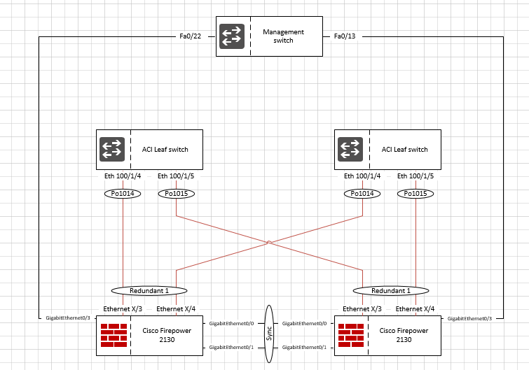
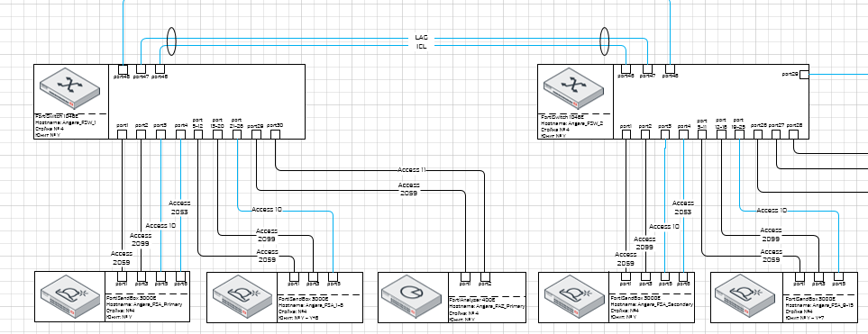
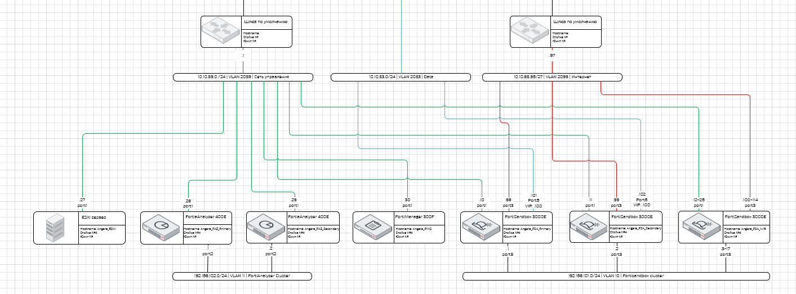
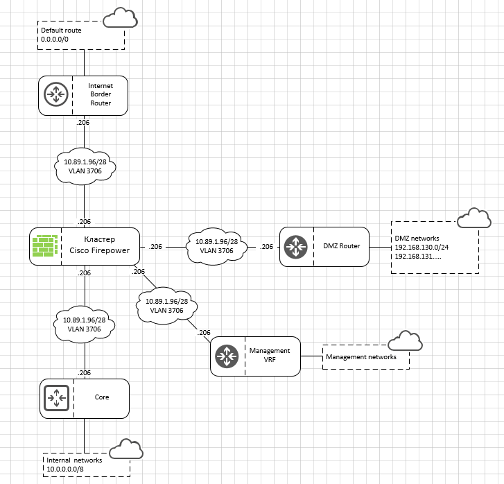

# Network diagrams

Типы схем

- Структурная, логическая - Нет IP адресов, портов, виланов
- L3
- L2

Принципы

- Считать количество линков по VLAN а не по шлюзам
- Симметрия везде и во всем
- Использование плоских стенсилов
- Прямоугольник с округленными углами разделенный пополам - значок и название
- Облачка с названием и номером VLAN и подсетью
- Прямоугольник с облачком для обозначением сетей за шлюзом
- Шрифт Калибри 8
- Элементы одинакового размера и на одном уровне

Резервирование линков, устройств, равномерное распределение по коммутаторам
Статься избегать пересечения линий
Номера и имена VLAN согласованы между L2 и L3
Выстраиваем объекты в одну линию

На Л2 и Л3 схемах указывается Хостнейм обязательно и наклейка такая же клеится на железку
На л2 юнит и стойка еще

Вначале готовишь блок с устройством, делаешь его идеально, убеждаешься что влазит Host name и после этого копоируешь его для всех остальных устройств, меняя только иконки

Для каждого устройства: Название, hostname, стойка, юнит.

Пересечение в Л3 - норма, в Л2 - нужно избегать

## L2 состав

- Длина и высота коробки чтобы все влезло!
- Название модели устройства
- Хостнейм
- Название физических портов
- Тип порта Access/Trunk - обсуждаемо
- Перечень VLAN в порту
- Наличие LAG, его название?
- Стойка, юнит - обсуждаемо
- Фон белый или сетка?

Примеры:

## L3 состав

- Длина и высота коробки чтобы все влезло!
- Название всех(логических и физических) интерфейсов у которых есть IP адрес
- IP адрес интерфейса, подсеть с маской и VLAN к которой он подключен
- На устройствах пишется только последний октет
- Виртуальные IP кластера, если применимо
- Модель устройства
- Хостнейм
- Информация о соседях(роутеры, МСЭ): Модель устройства, хостнейм, IP адрес
- Маршруты - обсуждаемо
- Стойка, юнит - обсуждаемо
- Фон белый или сетка?

Примеры:

